# Don't Let the Model Write the Query

*Software architecture for repeatable chat responses over SQL data*  
John Ulett · SageTechTN Vibe Coder

Slide-by-slide speaker notes. Each section gives what is on the slide, then what is said over it.
The rendered slides are in [`slides/`](slides/); the full deck is [`dont-let-the-model-write-the-query.pdf`](dont-let-the-model-write-the-query.pdf).

---

## Slide 1 · Title

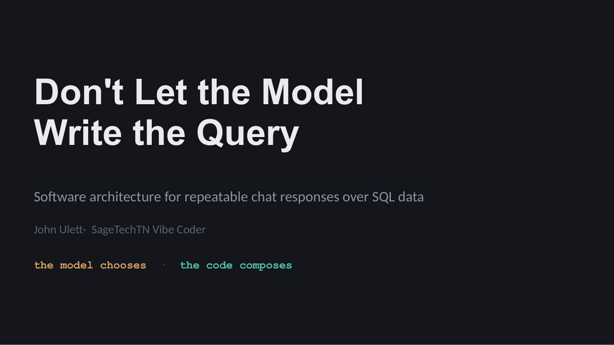

**On the slide**

- Software architecture for repeatable chat responses over SQL data

- John Ulett·  SageTechTN Vibe Coder

- the model chooses  ·  the code composes

**Speaker notes**

> Straight in — no agenda slide. At 20 minutes an agenda costs 4% of the talk to tell people what they will hear in 15.

---

## Slide 2 · Context — PeopleIQ - The domain, once

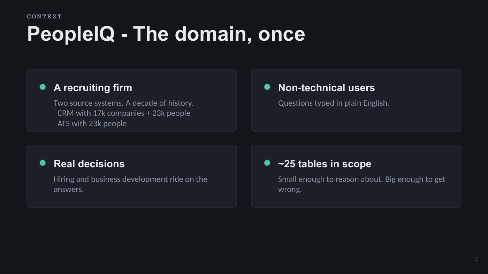

**On the slide**

- A recruiting firm

- Two source systems. A decade of history.  CRM with 17k companies + 23k people  ATS with 23k people

- Non-technical users

- Questions typed in plain English.

- Real decisions

- Hiring and business development ride on the answers.

- ~25 tables in scope

- Small enough to reason about. Big enough to get wrong.

**Speaker notes**

> 45 seconds, and mean it. Recruiting firm, an ATS and a CRM, ten years of data, recruiters who want to ask questions in English instead of filing a report request. That's it. Everything from here is architecture and none of it is specific to recruiting.
>
> This audience did not come for executive search. The most common way an architecture talk fails is spending five minutes on business context.

---

## Slide 3 · The Problem — Repeatability is not accuracy

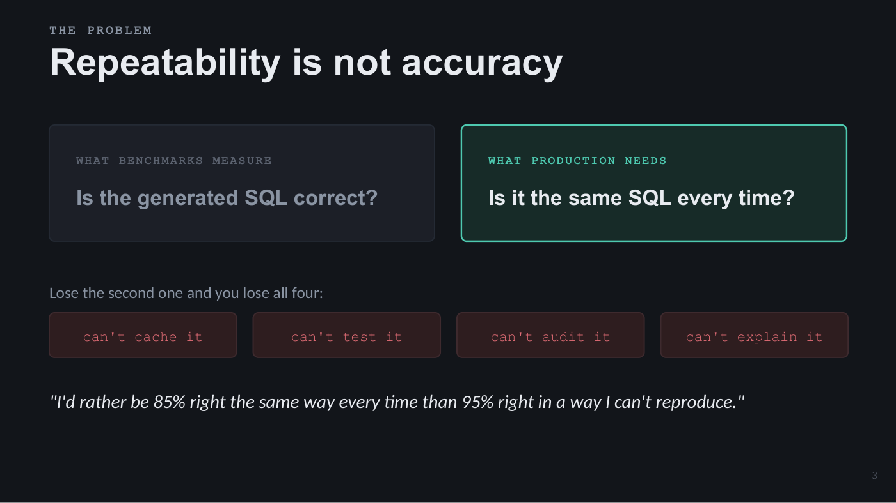

**On the slide**

- WHAT BENCHMARKS MEASURE

- Is the generated SQL correct?

- WHAT PRODUCTION NEEDS

- Is it the same SQL every time?

- Lose the second one and you lose all four:

- can't cache it

- can't test it

- can't audit it

- can't explain it

- "I'd rather be 85% right the same way every time than 95% right in a way I can't reproduce."

**Speaker notes**

> Every text-to-SQL paper measures accuracy. Accuracy is a benchmark property. The property a production system needs is repeatability — the same question produces the same query, today and next Tuesday.
>
> A system that is right 90% of the time and DIFFERENTLY right each time is unshippable for four separate reasons and only one of them is correctness. You can't cache a sampled query. Can't unit-test one. Can't audit one. And when a user says 'this number changed and I don't know why', you have nothing to show them but a token log.
>
> Say the quote slowly. It is the argument of the whole talk.

---

## Slide 4 · Positioning — Three ways to build this

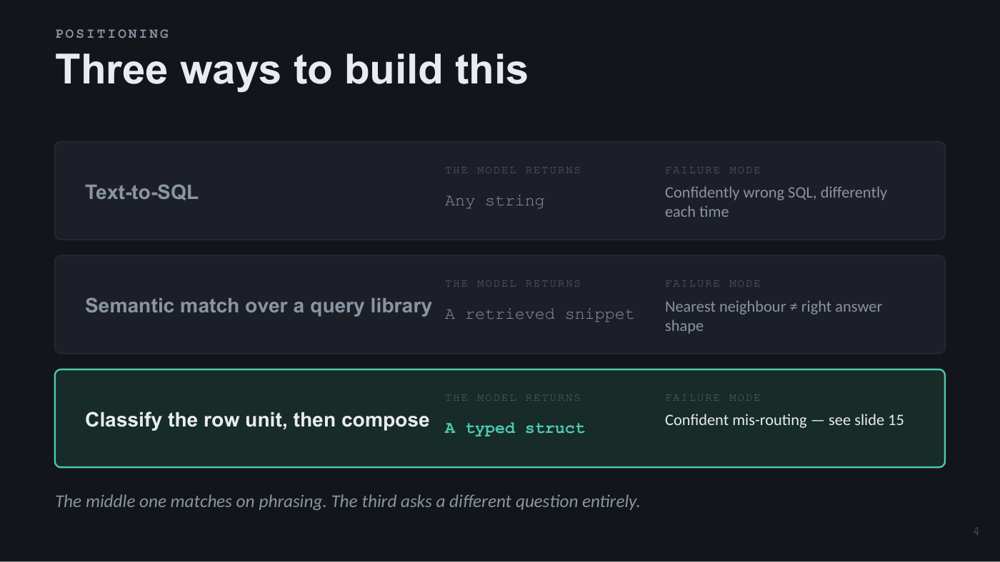

**On the slide**

- Text-to-SQL

- THE MODEL RETURNS

- Any string

- FAILURE MODE

- Confidently wrong SQL, differently each time

- Semantic match over a query library

- THE MODEL RETURNS

- A retrieved snippet

- FAILURE MODE

- Nearest neighbour ≠ right answer shape

- Classify the row unit, then compose

- THE MODEL RETURNS

- A typed struct

- FAILURE MODE

- Confident mis-routing — see slide 15

- The middle one matches on phrasing. The third asks a different question entirely.

**Speaker notes**

> There are three architectures in this space and I want to be precise about which one this is, because it gets confused with the middle one constantly.
>
> The first hands the schema to a model and hopes. The second embeds the question and nearest-neighbours a template library — RAG over SQL snippets, better than nothing, but matching on PHRASING. The third asks a completely different question, and it's the one I'm here to argue for.
>
> If you don't draw this distinction yourself, someone in Q&A will say 'so it's RAG over SQL snippets' and you'll spend three of your five Q&A minutes on it.

---

## Slide 5 · The Whole System — One model call, then deterministic code

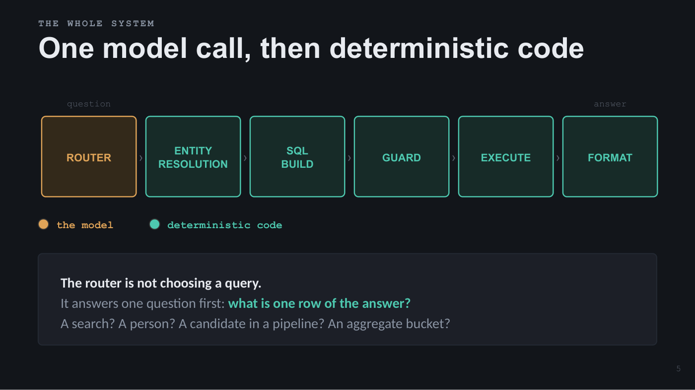

**On the slide**

`ROUTER › ENTITY RESOLUTION › SQL BUILD › GUARD › EXECUTE › FORMAT`

- question

- answer

- the model

- deterministic code

- The router is not choosing a query.
- It answers one question first: what is one row of the answer?
- A search? A person? A candidate in a pipeline? An aggregate bucket?

**Speaker notes**

> This is the whole system. One model call at the front.
>
> It also pulls the values out of the sentence — but as raw strings, dropped into slots the template defines. You’ll see exactly what it returns in two slides.
>
>
>
> Note what is CODE. Resolving 'Northwind' to the canonical company name is code — fuzzy string matching, not embeddings, not a second model call. Building the SQL is code. Validating it is code. Rendering the table is code. The model appears once more at the end, and only to write a sentence of English prose over results that were already computed.
>
> The reframing to say out loud: once you know the row unit, the template is implied. That's why the library is two dozen templates and not two hundred — they're organized by result SHAPE, not by question phrasing.

---

## Slide 6 · The Anchor — The blast radius, written down

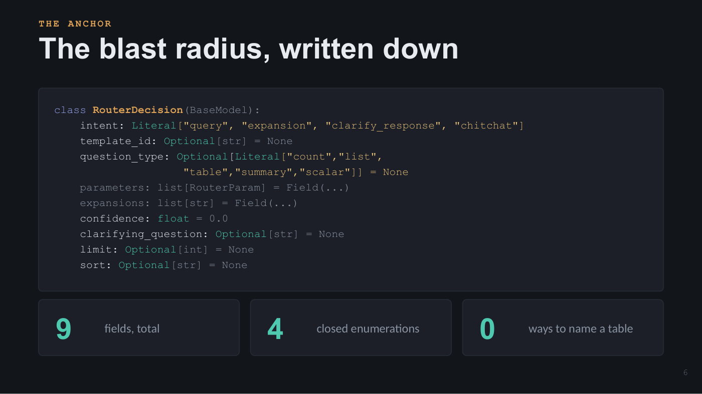

**On the slide**

```
class RouterDecision(BaseModel):
    intent: Literal["query", "expansion", "clarify_response", "chitchat"]
    template_id: Optional[str] = None
    question_type: Optional[Literal["count","list",
                    "table","summary","scalar"]] = None
    parameters: list[RouterParam] = Field(...)
    expansions: list[str] = Field(...)
    confidence: float = 0.0
    clarifying_question: Optional[str] = None
    limit: Optional[int] = None
    sort: Optional[str] = None
```

- 9

- fields, total

- 4

- closed enumerations

- 0

- ways to name a table

**Speaker notes**

> Anchor slide — give it two full minutes.
>
> This is a Pydantic model. The SDK turns it into a JSON schema, hands it to the API, and the response is constrained to conform. It isn't a prompt asking politely for JSON — it's the output format.
>
> Now count the fields. Nine. Four are closed enumerations — Literal means that set and nothing else. This class is the ENTIRE surface through which the model influences the database. It cannot emit SQL. It cannot name a table. It cannot add a column or reach a row it shouldn't, because there is no field in which to express any of that.
>
> Compare to text-to-SQL, where the output surface is 'any string' and the only thing between it and your database is a paragraph asking it to behave.
>
> The transferable idea, and it isn't about SQL: constrain the model's output surface, not its input.

---

## Slide 7 · The Library — Templates are data, not code

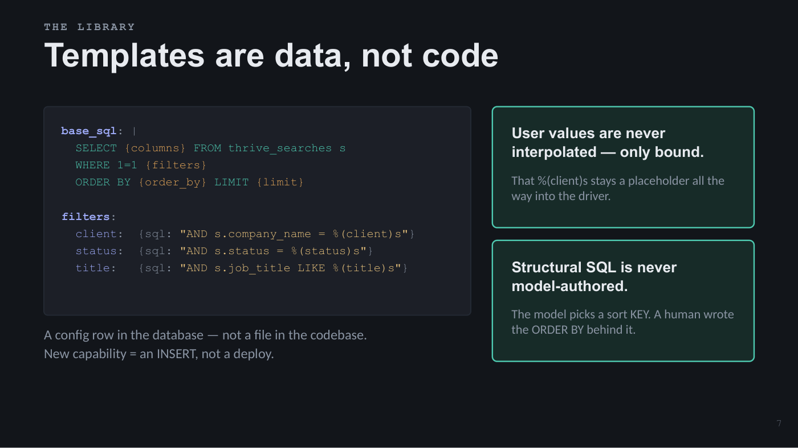

**On the slide**

```
base_sql: |
  SELECT {columns} FROM thrive_searches s
  WHERE 1=1 {filters}
  ORDER BY {order_by} LIMIT {limit}
 
filters:
  client:  {sql: "AND s.company_name = %(client)s"}
  status:  {sql: "AND s.status = %(status)s"}
  title:   {sql: "AND s.job_title LIKE %(title)s"}
```

- A config row in the database — not a file in the codebase.
- New capability = an INSERT, not a deploy.

- User values are never
- interpolated — only bound.

- That %(client)s stays a placeholder all the way into the driver.

- Structural SQL is never
- model-authored.

- The model picks a sort KEY. A human wrote the ORDER BY behind it.

**Speaker notes**

> A template is a parameterized SQL frame plus a description of what can be filtered and what can be shown. It lives as a config row in the database, so adding a capability is an INSERT, not a deploy.
>
> Two invariants, and they're the load-bearing ones. User values are never interpolated, only bound — that %(client)s stays a placeholder all the way into the driver. And structural SQL is never model-authored: even sorting, the model picks a sort KEY, a short string, and a human wrote the ORDER BY clause that key maps to.

---

## Slide 8 · The Objection — “But templates don’t scale”

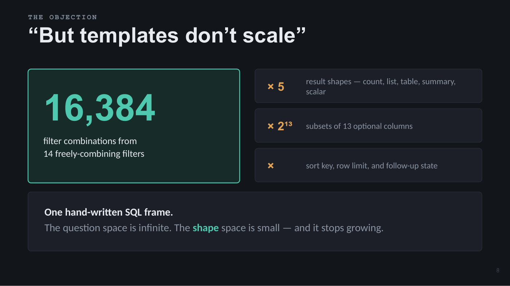

**On the slide**

- 16,384

- filter combinations from 14 freely-combining filters

- × 5

- result shapes — count, list, table, summary, scalar

- × 2¹³

- subsets of 13 optional columns

- ×

- sort key, row limit, and follow-up state

- One hand-written SQL frame.
- The question space is infinite. The shape space is small — and it stops growing.

**Speaker notes**

> This is the objection everyone has, so get to it before they do. The instinct is 'one template equals one answer' and then you imagine maintaining four hundred.
>
> Here's one real template. Fourteen filters that combine freely — two to the fourteenth, sixteen thousand combinations on its own. Five result shapes. Thirteen optional columns in any combination. Sort and limit on top.
>
> One template isn't one answer. It's one RESULT SHAPE. And business domains have this property: the question space is infinite, but the shape space is small. Searches, people, candidacies, deals, organizations, activities, and aggregates of those. Couple dozen shapes, and it stops growing while the questions never do.

---

## Slide 9 · Why Templates Compound — Where domain knowledge goes to live

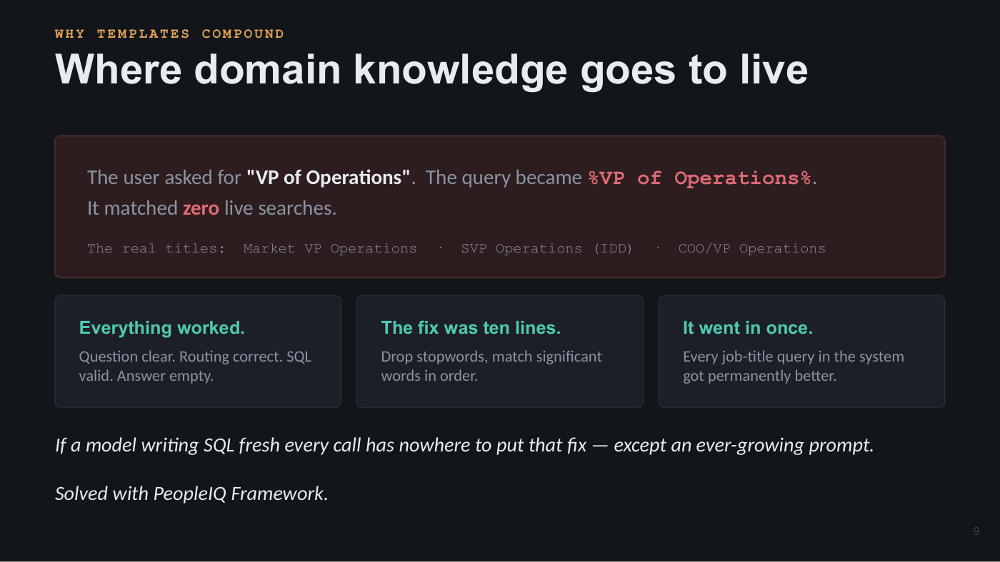

**On the slide**

```
The user asked for "VP of Operations".  The query became %VP of Operations%.
It matched zero live searches.
```

- The real titles:  Market VP Operations  ·  SVP Operations (IDD)  ·  COO/VP Operations

- Everything worked.

- Question clear. Routing correct. SQL valid. Answer empty.

- The fix was ten lines.

- Drop stopwords, match significant words in order.

- It went in once.

- Every job-title query in the system got permanently better.

- If a model writing SQL fresh every call has nowhere to put that fix — except an ever-growing prompt.
- Solved with PeopleIQ Framework.

**Speaker notes**

> My favourite bug in the system, because everything about it was working. The user's question was clear. The model routed it correctly. The SQL was valid. The answer was empty — because nobody stores a job title the way anybody asks for it.
>
> The fix is a matcher that drops stopwords and matches significant words in order. Ten lines. It went into one filter specification and every job-title query got permanently better.
>
> Now ask what happens to that fix when the model writes SQL fresh on every call. There's nowhere to put it, except an ever-growing prompt that re-teaches your data's quirks every request.
>
> Templates are where institutional knowledge accumulates. That, more than safety, is the compounding argument.

---

## Slide 10 · One Question, All The Way Down   1/4 — The question in, the struct out

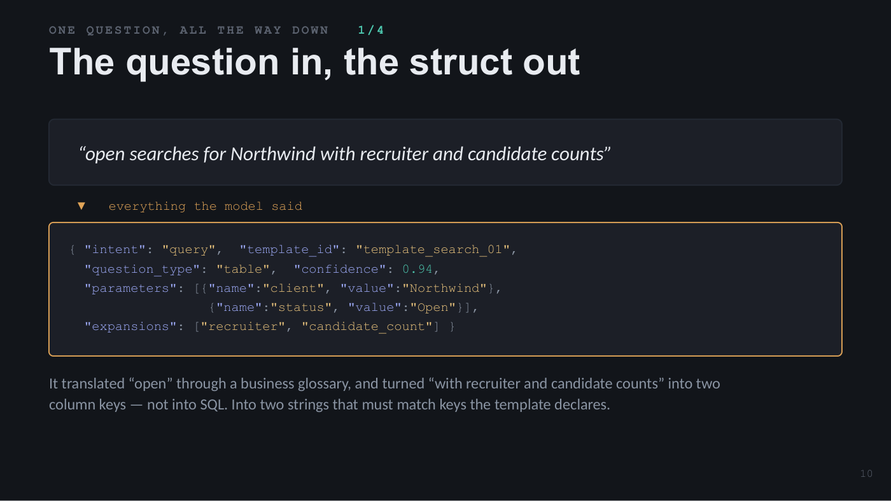

**On the slide**

- “open searches for Northwind with recruiter and candidate counts”

- ▼   everything the model said

```
{ "intent": "query",  "template_id": "template_search_01",
  "question_type": "table",  "confidence": 0.94,
  "parameters": [{"name":"client", "value":"Northwind"},
                  {"name":"status", "value":"Open"}],
  "expansions": ["recruiter", "candidate_count"] }
```

- It translated “open” through a business glossary, and turned “with recruiter and candidate counts” into two
- column keys — not into SQL. Into two strings that must match keys the template declares.

**Speaker notes**

> One question, all the way down. This is everything the model said.
>
> Note it translated 'open' into the stored status value through a business glossary, and it turned 'with recruiter and candidate counts' into two named column requests — not into SQL, into two strings that have to match keys the template declares.

---

## Slide 11 · One Question, All The Way Down   2/4 — The SQL the code built

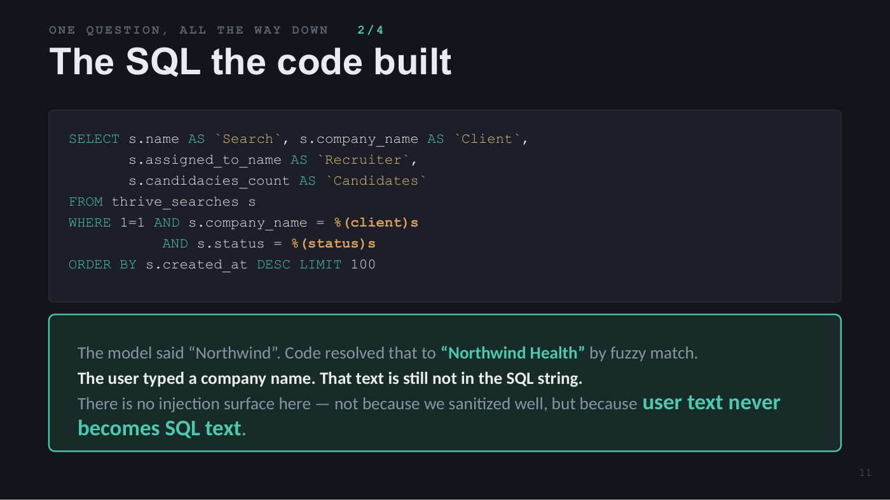

**On the slide**

```
SELECT s.name AS `Search`, s.company_name AS `Client`,
       s.assigned_to_name AS `Recruiter`,
       s.candidacies_count AS `Candidates`
FROM thrive_searches s
WHERE 1=1 AND s.company_name = %(client)s
           AND s.status = %(status)s
ORDER BY s.created_at DESC LIMIT 100
```

- The model said “Northwind”. Code resolved that to “Northwind Health” by fuzzy match.
- The user typed a company name. That text is still not in the SQL string.
- There is no injection surface here — not because we sanitized well, but because user text never becomes SQL text.

**Speaker notes**

> A deterministic function of the struct and the template record — no model involved. Note the first line: the model said “Northwind” and code resolved it to the canonical company — fuzzy string matching against the company table, not embeddings and not a second model call. That is the Entity Resolution box from the architecture slide, doing its one job.
>
> Point at the placeholder. The user typed a company name and that text is still not in the SQL string. It's a bound parameter. There is no SQL injection surface here, not because we sanitized well, but because user text never becomes SQL text.

---

## Slide 12 · One Question, All The Way Down   3/4 — The guard

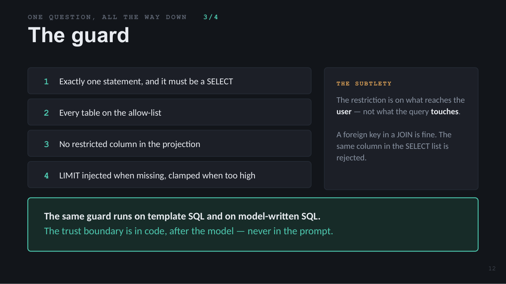

**On the slide**

- 1

- Exactly one statement, and it must be a SELECT

- 2

- Every table on the allow-list

- 3

- No restricted column in the projection

- 4

- LIMIT injected when missing, clamped when too high

- THE SUBTLETY

- The restriction is on what reaches the user — not what the query touches.
- A foreign key in a JOIN is fine. The same column in the SELECT list is rejected.

- The same guard runs on template SQL and on model-written SQL.
- The trust boundary is in code, after the model — never in the prompt.

**Speaker notes**

> Every statement is parsed into an AST — sqlglot — before it executes. Not regex. Parsed.
>
> Rule three has a subtlety worth your time: the restriction is on what reaches the USER, not what the query TOUCHES. A foreign key in a JOIN or a WHERE is fine. The same column in the SELECT list is rejected. So the guard resolves table aliases and walks into scalar subqueries in the projection, because that's a real path to the user's screen.
>
> The bold line is the actual security claim. This is not a safety net for the fallback path — it runs on the SQL we wrote ourselves, every time. Assume the prompt failed. Design for it.

---

## Slide 13 · One Question, All The Way Down   4/4 — Ask it again tomorrow

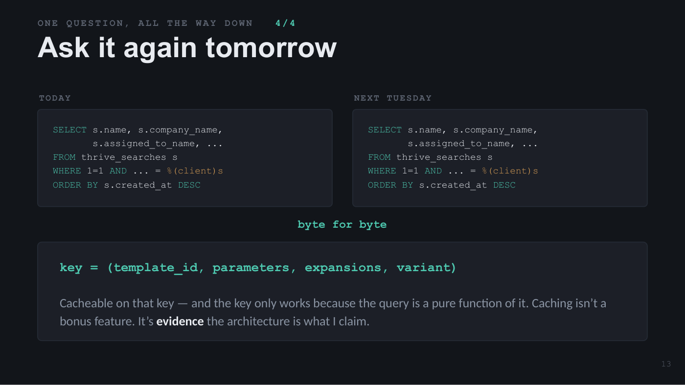

**On the slide**

- TODAY

```
SELECT s.name, s.company_name,
       s.assigned_to_name, ...
FROM thrive_searches s
WHERE 1=1 AND ... = %(client)s
ORDER BY s.created_at DESC
```

- NEXT TUESDAY

```
SELECT s.name, s.company_name,
       s.assigned_to_name, ...
FROM thrive_searches s
WHERE 1=1 AND ... = %(client)s
ORDER BY s.created_at DESC
```

- byte for byte

```
key = (template_id, parameters, expansions, variant)
 
Cacheable on that key — and the key only works because the query is a pure function of it. Caching isn’t a bonus feature. It’s evidence the architecture is what I claim.
```

**Speaker notes**

> Same question tomorrow, same SQL — byte for byte. Which means it's cacheable on that four-part key, and that key only works because the query is a pure function of it.
>
> Caching isn't a bonus feature here. It's EVIDENCE the architecture is what I claim it is. If your system can't be cached this way, it isn't repeatable — whatever else it is.

---

## Slide 14 · The Escape Hatch — The 5% you can’t template

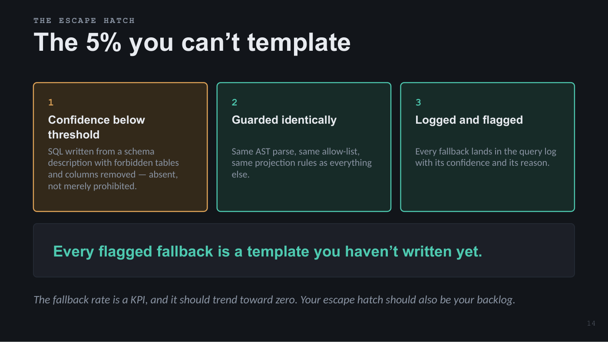

**On the slide**

- 1

- Confidence below threshold

- SQL written from a schema description with forbidden tables and columns removed — absent, not merely prohibited.

- 2

- Guarded identically

- Same AST parse, same allow-list, same projection rules as everything else.

- 3

- Logged and flagged

- Every fallback lands in the query log with its confidence and its reason.

- Every flagged fallback is a template you haven’t written yet.

- The fallback rate is a KPI, and it should trend toward zero. Your escape hatch should also be your backlog.

**Speaker notes**

> I'm not arguing against model-generated SQL. I'm arguing against it being the DEFAULT. Keep the escape hatch — some questions are genuinely one-offs and it's better to answer them imperfectly than to refuse.
>
> Two things make it safe, one makes it useful. Safe: the schema description has forbidden tables and columns removed STRUCTURALLY — they aren't prohibited, they're absent — and the output goes through the same guard as everything else. Useful: every fallback is flagged, so the fallback rate is a KPI that should trend toward zero.

---

## Slide 15 · Honest Costs — What this costs you


**On the slide**

- Coverage grows linearly with human effort

- A new result shape means someone writes SQL. That is a real ceiling.

- The template library is a second schema

- Kept in sync with the real one by hand.

- Confident mis-routing is the scary failure

- Bad generated SQL errors loudly. A wrong template returns a beautiful, correctly formatted table answering a question nobody asked.

- Config-as-data has no type checker

- A malformed template row degrades quietly rather than failing the build.

- Two mitigations: thresholds shouldn’t be cliffs, and “ask a clarifying question” is a valid output.

**Speaker notes**

> If I only gave you the good parts you'd be right not to trust me. Four real costs.
>
> The third is the interesting one and I'd think hard about it before adopting this. In text-to-SQL a mistake usually FAILS — bad column, syntax error, something red. Here a mis-route SUCCEEDS. You get a perfectly formatted table confidently answering the wrong question and nothing in the UI looks wrong. That's why every turn logs its template id and confidence: it's the only way to find these after the fact.
>
> Two mitigations worth stealing. Confidence thresholds shouldn't be cliffs — if the model picks a valid template AND extracts a real filter but lands just under the bar, run it and log it as its own route class, because a vetted query beats freeform SQL. And when the shape is genuinely ambiguous the router may return a clarifying question. Asking is a valid output.

---

## Slide 16 · Takeaways — Three things, none about SQL

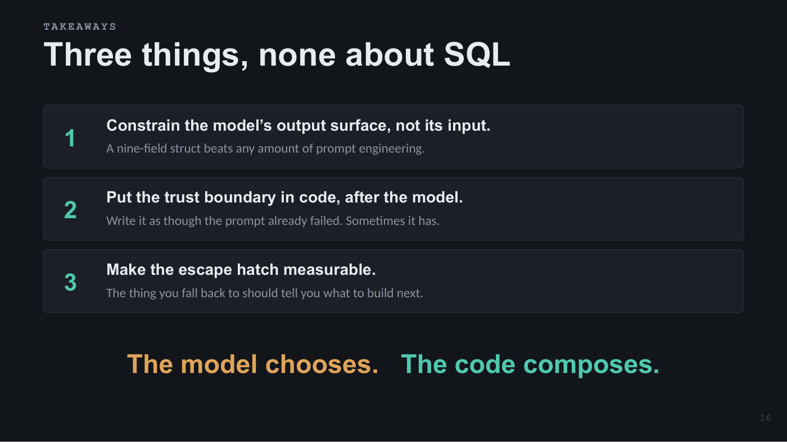

**On the slide**

- 1

- Constrain the model’s output surface, not its input.

- A nine-field struct beats any amount of prompt engineering.

- 2

- Put the trust boundary in code, after the model.

- Write it as though the prompt already failed. Sometimes it has.

- 3

- Make the escape hatch measurable.

- The thing you fall back to should tell you what to build next.

- The model chooses.   The code composes.

**Speaker notes**

> Three things to take home, none of which are about SQL.
>
> Constrain the output surface — a nine-field struct beats any amount of prompt engineering. Put the trust boundary after the model, in code that assumes the prompt failed. And make your escape hatch measurable so the thing you fall back to tells you what to build next.
>
> The model is doing something genuinely hard here — resolving pronouns against conversation state, translating business vocabulary, deciding when to ask instead of guess. That's real intelligence. It just isn't the intelligence that should be writing your WHERE clause.
>
> The model chooses. The code composes. Thank you.

---
